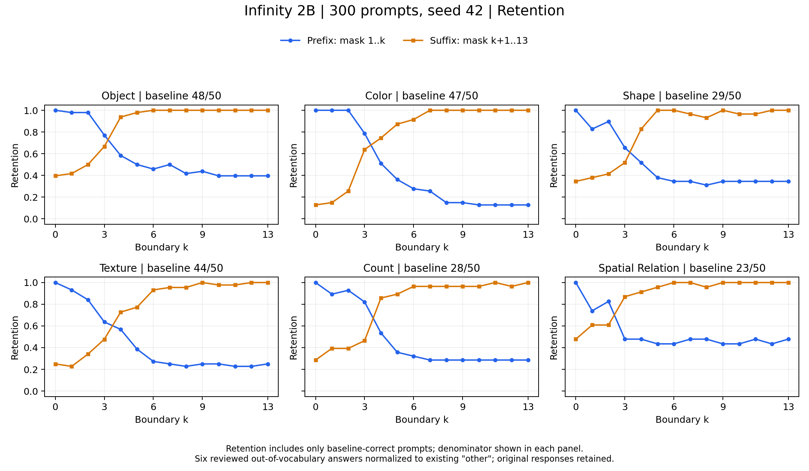
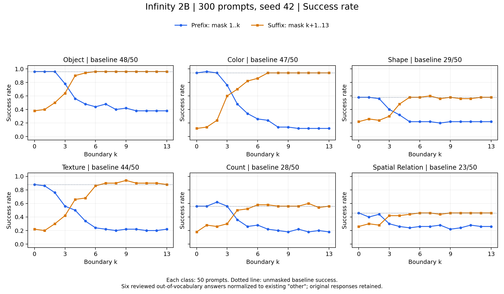
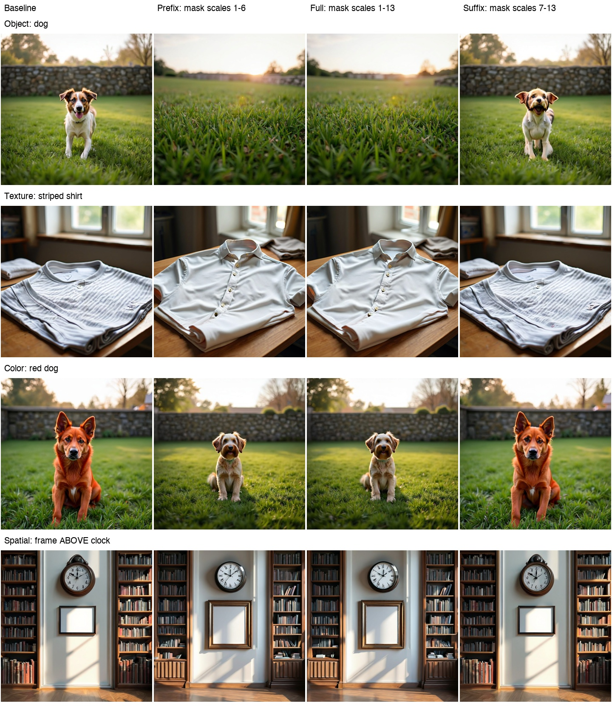

# Infinity Semantic-Class Masking

研究 **Infinity 在不同生成 scale 对六类 semantic 的直接 cross-attention 输入有多依赖**。本实验从 STAR 的“单词 mask”扩展为“整类 semantic mask”，使用独立的 Infinity 代码与实验目录。

**当前状态（2026-09-14）：300 个 prompt、seed 42、7,800 张图片已生成；全部评分和曲线已完成。** 仓库包含实验代码、冻结标注、逐图评分、完整曲线、代表性图片和修正记录。模型权重、虚拟环境、云端访问配置与全部原始图片不随 Git 分发。

## 实验做了什么

三个可独立改进的模块：

1. **Semantic 标注**：完整 prompt → 六类 semantic 与 `other` 的分段 → T5 token 索引。
2. **Infinity 生成与干预**：在指定 scale 的 conditional cross-attention 中屏蔽选定 semantic 的全部 token。
3. **评分与汇总**：Grounding DINO / Qwen3-VL 检查目标语义，统计 success rate、retention、paired delta 和 count MAE。

更新评分器可以对已有图片重新评分；更新标注或 mask 方式则需要重新生成对应干预图片。

### 六类 semantic

| 类别 | 示例 | 评分器与检查内容 |
|---|---|---|
| `object` | dog、garden、wall | Grounding DINO：指定物体是否存在 |
| `color` | red、blue | Qwen3-VL：物体主表面颜色 |
| `shape` | round、triangular | Qwen3-VL：物体整体轮廓 |
| `texture` | striped、rough | Qwen3-VL：pattern 或 surface roughness |
| `count` | two、three | Grounding DINO：指定类别的数量 |
| `spatial_relation` | to the left of、inside | DINO：左右/上下；Qwen3-VL：前后/包含 |

`other` 是六类之外的其余文本，**不参与 mask**。同一 semantic 所有分散或重复的片段均进入 mask，包括已标注的背景实体或关系，不只是旧数据中的一个目标词。

例如 `A red round smooth plate is to the left of a blue striped cup, with two spoons.` 中，color mask 为 `red + blue`，object mask 为 `plate + cup + spoons`，texture mask 为 `smooth + striped`。

**本次 300-prompt 数据集每条 prompt 只干预其 `target_semantic`**，不是每条都做六类干预。没有指定 `target_semantic` 的多语义样例支持依次干预所有出现的类。

### Backbone 与干预位置

| 配置 | 本次取值 |
|---|---|
| Backbone | Infinity-2B，实际约 2.20B 参数 |
| Transformer | 32 层、2048 hidden dim、16 attention heads |
| 文本编码器 | FLAN-T5-XL |
| 输出 | 1024 × 1024，13 个 scale |
| Seed / CFG | 42 / 4.0 |
| 采样 | tau=1、top-k=900、top-p=0.97 |
| GPU | NVIDIA A40；Torch 2.5.1、FlashAttention 2.7.4.post1 |

完整配置见 [configs/infinity_2b.json](configs/infinity_2b.json)，固定源码/权重版本见 [vendor/sources.json](vendor/sources.json)、[configs/weights_source.json](configs/weights_source.json)。

实现是在指定 scale 的所有 32 个生成 block 中过滤条件分支的选定文本位置，使这些位置不能提供 cross-attention K/V。**完整 prompt 的 T5 embedding、池化/global conditioning 和 unconditional 分支保持不变**，不删词后重新编码。

所以这里测量的是对直接 cross-attention 通路的依赖。语义仍可能通过其他 token 的上下文 embedding、global conditioning、先前 scale 或生成先验保留；full mask 不是彻底消除语义。

### Scale、prefix 与 suffix

13 个 scale 的空间边长为 `1, 2, 4, 6, 8, 12, 16, 20, 24, 32, 40, 48, 64`。

横轴 `k` 是 scale 的**边界索引**（0～13），不是像素边长：

- **Prefix(k)**：mask scale `1..k`。
- **Suffix(k)**：mask scale `k+1..13`。
- `Prefix(0) = Suffix(13) = baseline`，完全不 mask。
- `Prefix(13) = Suffix(0) = full mask`，mask 全部 scale。

端点去重后，每个 prompt/seed 共 **26 张主图**：1 baseline + 12 prefix + 12 suffix + 1 full mask。300 × 26 = **7,800 张**。每个 prompt 另有原生参考图和一次 full-mask 重复推理，用于诊断，不计入主图数量。

## 数据与已完成阶段

数据来自既有 CSFM 衍生受控 prompt 集，六类各 50 条，共 300 条，包含十个场景家族；不声称是独立标准 benchmark。原文、历史单词 spans 和元数据保存在 [source_prompts.json](data/csfm50_v1/source_prompts.json)。

Qwen3-VL-8B-Instruct 仅用文本进行分组，每批 8 条；共享规则在 [annotation_policy.json](configs/annotation_policy.json)。检查原文、索引、完整分段、重复位置和已知目标，再映射到真实 T5 token。286 条自动接受、14 条人工修正，300 条均通过 T5 校验；修正有独立记录。规则是当前数据集的有限策略，仍可优化。

| 阶段 | 范围 | 结果 |
|---|---|---|
| 最小验证 | 单 prompt、color、4 图 | 生成与评分跑通 |
| 单 prompt 全 scale | 六类共用 baseline、151 图、260 项检查 | 一致性与接口验证通过 |
| 数据集预实验 | 10 prompt × 4 条件 = 40 图 | 40 项评分完成，人工查看对照图 |
| 完整实验 | 300 prompt × 26 条件 = 7,800 图 | 7,800 项评分、448 行曲线数据 |

完整生成的 **600 项 native/no-op 与 full-mask repeat 检查全部通过**。预实验另核对了 16,640 条 layer/scale 日志；完整实验每次推理时执行 mask 验证。最终逐样本 baseline 配对及全部 448 行聚合统计在本地重新核算通过。[结果审计](reports/csfm50_full_review/audit_summary.json)

## 主要结果

### Baseline 与 retention

**Baseline 成功率**是不 mask 时的正确数 / 50；**retention**只在 baseline 原本正确的样本中计算 mask 后仍正确的比例，二者分母不同。

例如 50 个 prompt 有 40 个 baseline 正确，mask 后其中 30 个仍正确，则 baseline=80%，retention=75%。Baseline 原本错误、mask 后变正确的样本影响总体 success rate，但不影响 retention。

| Semantic | Baseline 正确数 | Baseline 成功率 | Prefix(6) retention | Suffix(6) retention | Full-mask retention |
|---|---:|---:|---:|---:|---:|
| Object | 48/50 | 96% | 45.8% | 100.0% | 39.6% |
| Color | 47/50 | 94% | 27.7% | 91.5% | 12.8% |
| Shape | 29/50 | 58% | 34.5% | 100.0% | 34.5% |
| Texture | 44/50 | 88% | 27.3% | 93.2% | 25.0% |
| Count | 28/50 | 56% | 32.1% | 96.4% | 28.6% |
| Spatial relation | 23/50 | 46% | 43.5% | 100.0% | 47.8% |

本次观察到：屏蔽前 6 个 scale 的影响明显大于只屏蔽后 7 个 scale；color、texture 在 full mask 下保留率较低。这支持本设置对早期直接文本输入的依赖，但不能把某个边界当成语义“完成写入”的精确时刻。曲线可能非单调，不同类别 baseline 能力也有差异。





汇总先按 prompt/seed 聚合，避免多检查样本权重更高。CSV 同时保存子类型、有效样本数、baseline-correct 数量、paired delta 和 count MAE。`missing`、`ambiguous` 按现有协议记为语义成功率 0；执行错误不作为 0。修正后状态为 **3,842 correct、3,569 incorrect、190 missing、199 ambiguous**，无剩余执行错误。

完整数据：[逐图评分 JSONL](reports/csfm50_full/evaluation/scores/results.jsonl) · [曲线 CSV](reports/csfm50_full/evaluation/scores/scale_curves.csv) · [分组摘要](reports/csfm50_full/evaluation/scores/summary.json) · [核对报告](reports/csfm50_full_review/review.md)。JSONL 较大，可下载后分析；图表提供 PNG 与 PDF。

### 六项评分修正与局限

原评分器有 6 项 `Invalid answer category`：3 次 `silver`、2 次 `gray`、1 次 `octagonal`。这些是明确但未列举的类别，经审核归入协议已有的 `other`，按原函数重算，六项均为 incorrect。它是**显式记录的事后结果归一化**，不是重新推理，也不是把任意解析失败统一计为错误。原始回答、两次尝试、原始错误和 SHA256 均保留；其他 7,794 项文件哈希未变。[修复记录](reports/csfm50_full/evaluation/scores/repairs/category_other_v1/repair_report.json)

评分答案的 `other` 与 prompt 标注的 `other` 是不同概念。评分器源码保持冻结，修复作为独立脚本提供。

本结果仅是单 seed、受控 prompt 集的探索性自动评分。预实验发现红/橙边界、粗糙/光滑判断有歧义，DINO 可能误检；完整 7,800 张尚未逐张人工复核。Shape、count、spatial 的 baseline 较低，retention 有效分母须同时报告。

### 代表性预实验图片

每行从左至右为 baseline、prefix(6)、full mask、suffix(6)。这是 **40 图预实验的选例**，不是全部完整实验图片。



## 文件结构

各阶段结果、验证文件和本地运行记录的入口见 [reports 分类索引](reports/README.md)。目录保持原路径，以兼容已有脚本。

```text
.
├── README.md
├── configs/                       # Infinity 参数、标注规则、权重版本
├── data/
│   ├── csfm50_v1/                 # 300 prompt、最终标注、冻结 checks、修正记录
│   │   └── annotations_qwen3vl/    # 标签、原始回答、标注溯源
│   └── smoke_*.json               # 单 prompt 六类样例
├── semantic_masking.py            # 整类片段合并与分段校验
├── annotation_policy.py           # 标注规则与响应解析
├── annotate_semantics.py          # 单 prompt/API 标注入口
├── tokenize_prompts.py            # T5 字符跨度 → token 映射
├── infinity_mask.py               # 指定 scale 的 conditional CA 干预
├── generate.py                    # 计划、生成、一致性检查、逐层审计
├── evaluate.py                    # 图片与冻结评分任务对接
├── summarize.py                   # success/retention/delta/count MAE
├── scripts/                       # 安装、运行、修复、审计、绘图
├── tests/                         # 分段、token、mask、计划和接口测试
├── vendor/
│   ├── sources.json               # 第三方源码版本
│   ├── semantic-evaluators/        # 冻结评分包副本
│   └── Infinity/                  # setup_sources.py 下载；不纳入 Git
└── reports/
    ├── csfm50_full/                # 完整输入快照、生成清单、全部评分
    ├── csfm50_full_review/         # 最终曲线、统计审计、报告
    ├── pilot_review/              # 10 prompt 预实验图片、评分表、曲线
    ├── full_review/               # 早期单 prompt 全 scale 验证报告
    └── infinity_scale_index.patch # baseline/干预共用的上游修正
```

`reports/csfm50_full/generation/runs.jsonl` 保存主图 SHA256、条件、mask token 与审计路径。原始绝对路径属于历史运行溯源，不是新环境输出目录。全部原图及逐层 audit 文件仍保存在原实验 GPU workspace，本仓库不包含它们。

## 复现与使用

### 查看结果 / 重画曲线（无需 GPU）

```bash
git clone https://github.com/hlg7/infinity-semantic-masking.git
cd infinity-semantic-masking
python3 -m venv .venv
.venv/bin/python -m pip install -r requirements-analysis.txt
.venv/bin/python scripts/review_dataset_full.py
```

该命令从已提交的评分 JSONL 重新核对聚合值并生成曲线，无需模型或原图。

### 准备源码与本地测试

```bash
.venv/bin/python -m pip install -r requirements-local.txt
python3 scripts/setup_sources.py
.venv/bin/python scripts/download_weights.py --tokenizer-only
bash scripts/check_local.sh

# 只验证完整数据集的 7,800 图计划，不生成图片
.venv/bin/python generate.py --annotations data/csfm50_v1/annotations.json \
  --mode full --seeds 42 --plan-only --output outputs/plan_300
```

Infinity 源码固定于 `9f9fcd1de7ead377ddf1106db1249a35f3a59143`。初始化脚本应用一个 `scale_ind` 转发补丁，修正非 fused norm 路径后续 scale 的 RoPE；baseline 与 mask 使用同一补丁。

### 在 Linux CUDA GPU 上重新运行

```bash
python3 scripts/setup_sources.py
bash scripts/setup_gpu.sh
.venv-gpu/bin/python scripts/download_weights.py

# 使用已提交的最终标注，无需重新跑标注
.venv-gpu/bin/python generate.py --annotations data/csfm50_v1/annotations.json \
  --mode full --seeds 42 --output outputs/new_full/generation
.venv-gpu/bin/python evaluate.py --run outputs/new_full/generation \
  --checks data/csfm50_v1/checks.json --output outputs/new_full/evaluation
.venv-gpu/bin/python summarize.py --scores outputs/new_full/evaluation/scores \
  --generation outputs/new_full/generation
```

FlashAttention 安装需要 CUDA 开发环境。首次评分会加载或下载固定版本的 Grounding DINO / Qwen3-VL 权重。

后台按生成→评分→汇总顺序执行：

```bash
mkdir -p reports
nohup .venv-gpu/bin/python -u scripts/run_dataset_full_remote.py \
  > reports/runpod_dataset_full.log 2>&1 < /dev/null &
```

此脚本仅在当前机器运行，不创建云端实例。使用 `outputs/csfm50_full/`，先验证 300 prompt / 7,800 图配对并保存输入快照，再执行；已有目录拒绝覆盖。状态为 `reports/runpod_dataset_full_status.json`。

### 标注与失败处理

重新标注入口为 `scripts/annotate_dataset_gpu.py`，读取 `data/csfm50_v1/prompts.json` 和共享策略，输出 `annotations_qwen3vl`。默认复用已验证标签；改策略时需使用独立归档/输出，避免混淆版本。[数据说明](data/csfm50_v1/README.md)

生成器当前**不自动断点续跑**，失败后已保存逐图结果，但不能直接覆盖同一目录。评分器保存逐图预测并支持失败项重试。类别或协议问题应先记录再处理，不应默默删除样本。迁移历史原图到新环境后，重新评分需要重建图片路径、评分 manifest 并使用新的输出目录。

`scripts/repair_score_categories.py` 严格检查本次六项修复的 IDs、原始回答、错误类型和输入摘要；它不是用于任意新实验错误的通用自动规则。

## 来源

- [FoundationVision/Infinity](https://github.com/FoundationVision/Infinity)：生成模型及其许可证；权重另行下载。
- [hlg7/semantic-evaluators](https://github.com/hlg7/semantic-evaluators)：冻结于 `55dd2cd614748b5962b5bc4c186d7865efef6285`。
- [第三方来源与版本](THIRD_PARTY.md)。
