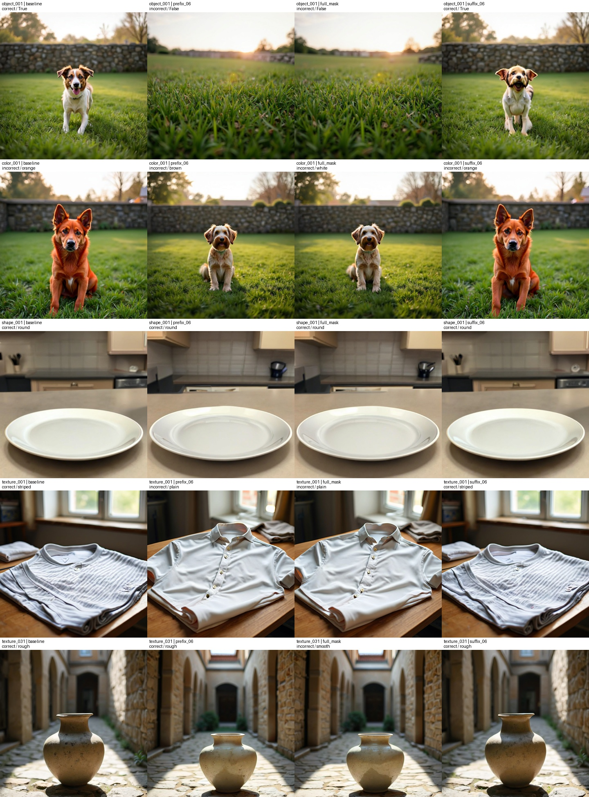
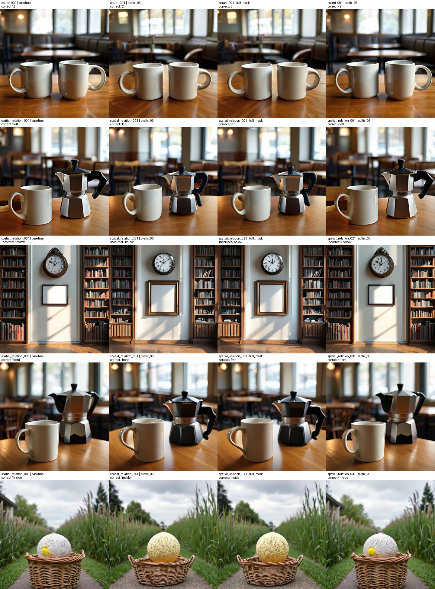

# Infinity 10-prompt 预实验核对

2026-09-13。结果已下载至 `reports/csfm50_pilot`。本轮仅核对现有输出，没有修改标注、生成流程或评分器，没有启动完整数据集实验。

## 流程检查

- 10 个 prompt、seed 42，各 4 张：baseline、prefix_06（mask scale 1–6）、full_mask（1–13）、suffix_06（7–13）。40 张实验图片之外，另存有 10 张原生生成参考图，因此递归统计 PNG 为 50。
- 40 张实验图 SHA256 与生成记录和评分记录逐一一致；40 项评分全部返回有效结果，无执行失败或 missing。
- 16,640 条 layer/scale 记录全部通过：32 层 × 13 scale × 40 张。实际 mask scale 和移除的 conditional key 数量与目标 token 一致。
- 10 个 prompt 的实际 encoder token IDs 匹配；每个 prompt 的 3 个干预条件均使用其 target_semantic 整类 token。
- 10 项 native/no-op 一致性、10 项 full-mask 重复一致性检查全部通过。
- 96 行汇总的 success rate、baseline-correct 数量和 retention 从评分记录重新计算并核对通过。
- 10 个 baseline 中 8 个被评分器判定正确。所有干预条件合计 27 correct、13 incorrect；该混合比例不作为实验结论。

复核脚本：`scripts/review_pilot.py`；机器结果：`audit_summary.json`；逐条件评分：`score_table.csv`。

## 图片与评分核对

查看了全部 40 张的对照图，并放大核对颜色 baseline 和两个花瓶干预图。

1. **上下关系 baseline：真实生成错误。** Prompt 要求 picture frame above wall clock，图中钟在相框上方。DINO 的两个框定位合理，输出 below 与画面一致。四个条件均为反向关系，不能把这个样本当作成功 baseline 的语义保留证据。
2. **颜色 baseline：红/橙边界歧义。** Prompt 要求 red dog，图中狗为明显红橙色；Qwen 输出 orange，并在 evidence 中写 reddish-orange。严格标签比较产生 incorrect，不能简单认定为评分器错误或完全未响应颜色。prefix/full-mask 后狗变为棕白色，suffix 后仍呈红橙色；全为 0 的二值分数没有体现这项视觉变化。
3. **纹理 surface：疑似评分边界不稳定。** rough vase 的 prefix_06 和 full_mask 原图都呈颗粒斑点表面，外观很接近，但分别判 rough / smooth。这一差异暂不作为粗糙度丢失的可靠证据，保留原图和模型原始回答供后续重评。
4. **Object 和条纹 pattern：可见变化与评分吻合。** early prefix/full-mask 后狗消失、条纹衬衫变为纯色；suffix 后目标保留。Object 实际同时 mask dog、garden、wall、trees，确认并非只 mask 一个词。
5. **Shape、count、其余空间关系：评分未变化。** 四条件仍显示圆盘、两只杯子、杯在壶左侧/前方、球在篮中。mask 执行记录正确；本次 mask 不移除其他词中的上下文信息及全局条件，语义也可能受到生成先验影响，因此全程 mask 后仍保留目标并不等于实现失败。

## 标注范围及下一步

本次核对证明生成器按已保存标注执行，不等于全部标注经过人工语义认证。例如部分空间关系目标还包含背景短语中的 `in the`；本轮保持已接受版本，以后可以独立优化标注。

按照先跑通流程的目标，可以继续当前 300 个 prompt（每类 50）、一个 seed、每 prompt 26 张的完整 scale 实验，共 7,800 张主实验图。保留所有 baseline，包括失败者；总体成功率照常统计，retention 仅在 baseline 正确的样本上统计。暂时冻结评分器，不因预实验图片好坏挑选或替换样本。

这 10 个样本按 source 顺序选取，且只测中间边界及端点，不足以得出各语义关键 scale 的普遍结论。完整实验尚未启动。

## 对照图

每行从左至右：baseline、prefix_06、full_mask、suffix_06。

